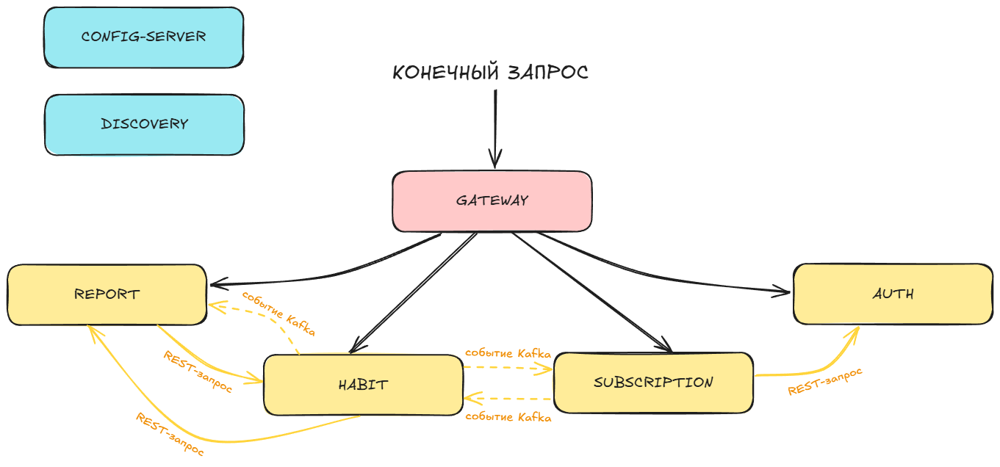
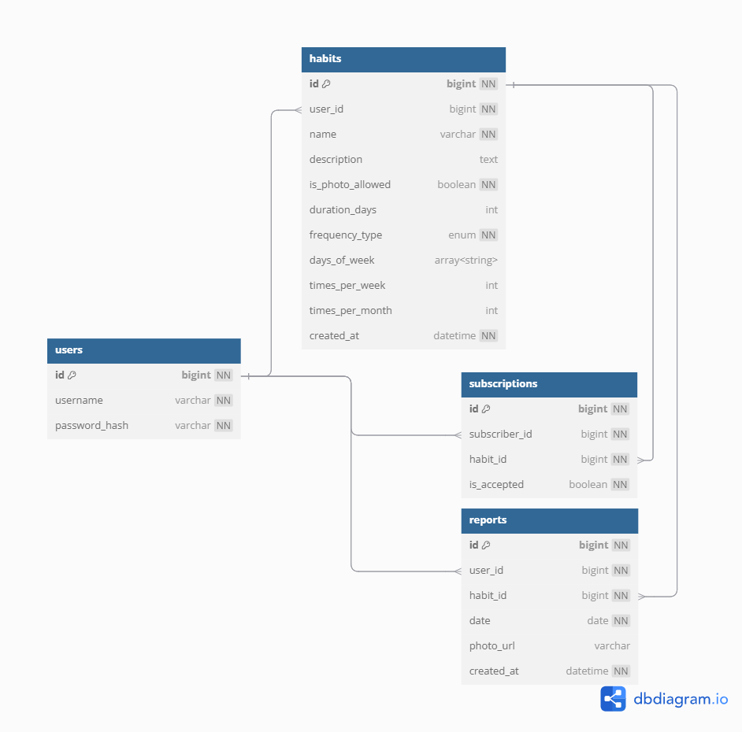
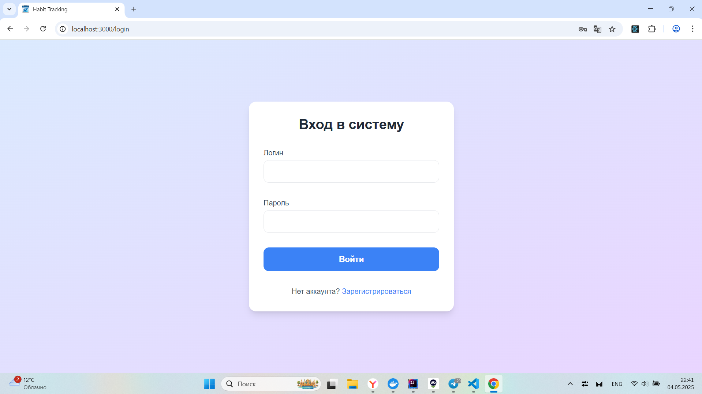
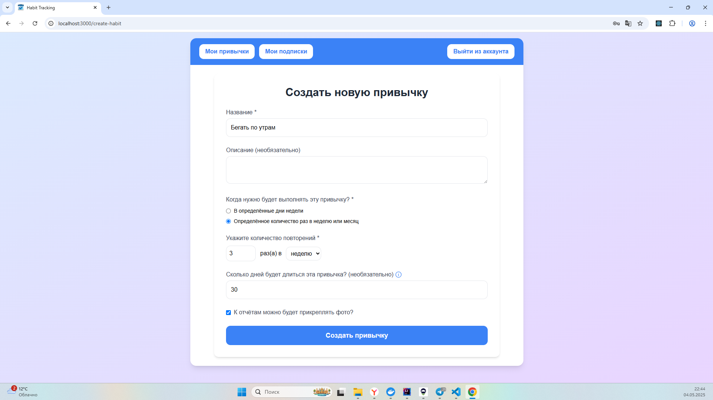
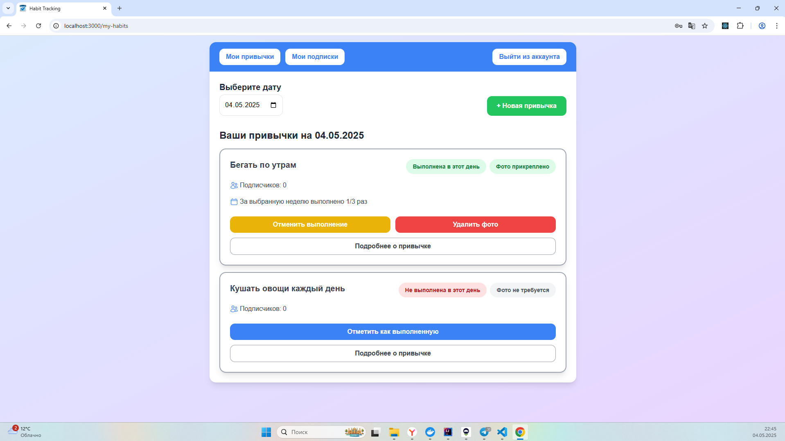
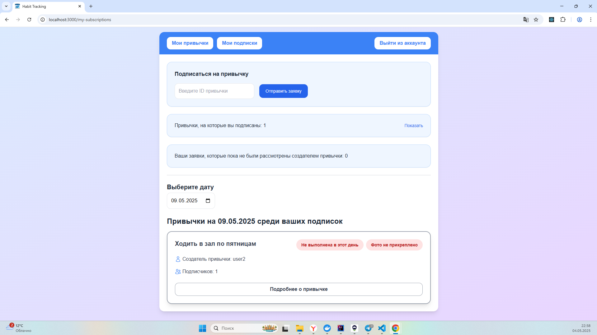

# 💡 Habit Tracker с взаимоконтролем

Это **фуллстек веб-приложение на Spring + React**, которое помогает формировать новые привычки вместе с другими людьми при помощи взаимного контроля

Основной акцент в проекте сделан на **бэкенд**: я старался выстроить **грамотную микросервисную архитектуру**, чтобы всё работало **эффективно** и было **масштабируемым** :)

Этот проект разрабатывался как курсовая работа за 3 курс

**Автор: Влад Михайлов**

## 📋 Что делает это приложение

✅ Позволяет **создавать привычки** и регулярно **отчитываться** об их выполнении

👀 Другие пользователи могут **подписываться на твои привычки** и **следить, как ты их выполняешь**

📸 К отчётам можно **прикреплять фото** — чтобы было видно, что ты действительно сделал то, что запланировал

🤝 Работает как **социальный трекер привычек** — когда за тобой следят друзья, появляется больше **мотивации** и **ответственности**

## 🛠️ Стек технологий

**Backend:** Java, Spring Boot (Web, Security + JWT, Data JPA), Spring Cloud (Eureka, Config Server, Gateway), PostgreSQL, Kafka, S3 API (MinIO), Swagger

**Frontend:** JavaScript, Vite, React, Tailwind CSS

**Инфраструктура:** Docker

**Тестирование:** JUnit, MockMvc, Testcontainers

## 📌 Схема микросервисов

## 🔧 Описание микросервисов

| Название микросервиса | Порт   | Описание                                                                                                                                                                                                                                                   |
|-----------------------|--------|------------------------------------------------------------------------------------------------------------------------------------------------------------------------------------------------------------------------------------------------------------|
| `config-server`       | `8888` | конфиг-сервер, который управляет настройками всех микросервисов                                                                                                                                                                                            |
| `discovery`           | `8761` | сервер **Eureka**, где регистрируются остальные микросервисы                                                                                                                                                                                               |
| `gateway`             | `8080` | единая точка входа, сюда отправляются все запросы от пользователей или микросервисов. Здесь проверяется **JWT-токен** (для внешних запросов) или **серверный токен** (для внутренних запросов), и если всё окей — запрос пересылается в нужный микросервис |
| `auth`                | `8081` | для запросов, связанных с аутентификацией                                                                                                                                                                                                                  |
| `habit`               | `8082` | для работы с привычками                                                                                                                                                                                                                                    |
| `report`              | `8083` | для работы с отчётами о выполнении привычек, здесь прикреплённые к отчётам фото загружаются через S3                                                                                                                                                       |
| `subscription`        | `8084` | для работы с подписками на привычки                                                                                                                                                                                                                        |

## 🔄 Взаимодействие микросервисов

Как один микросервис получает данные от другого? Есть два способа:

### 1️⃣ **Прямые REST-запросы**

Используются по минимуму, так как это медленно и создаёт сильную зависимость между микросервисами

### 2️⃣ **Event-driven data replication**

Часто используемые данные дублируются в нужных микросервисах, чтобы их не надо было постоянно запрашивать через REST-запросы

Передача таких данных происходит асинхронно через **Kafka**: один микросервис отправляет событие, а другой его получает

## 🗂️ Схема хранения основных сущностей

## 🧪 Тестирование

В проекте реализованы следующие типы тестов:

- **Юнит-тесты** — тестируют только один компонент, остальные мокаются
- **Интеграционные тесты** — запускают микросервис с реальной БД (поднимается в тестовом окружении), но с моками других микросервисов
- **End-to-end тесты** — тестируют взаимодействие полностью поднятых микросервисов

Запустить все юнит-тесты и интеграционные тесты можно через команду `./mvnw clean test -pl '!e2e-tests'` в корне проекта

Чтобы запустить end-to-end тесты, нужно сначала поднять всё окружение (например, через `docker-compose up`) и затем выполнить `./mvnw clean test -pl e2e-tests` в корне проекта

## 🚀 Запуск и использование

### 🐳 Запуск через Докер (быстрый способ)

Достаточно выполнить команду `docker-compose up` в корне проекта. Это автоматически поднимет инфраструктуру, а также соберёт и запустит все микросервисы и фронтенд. Спринг-приложения будут запускаться с профилем `docker`

Если в код вносились изменения, то нужно пересобрать образы и запустить их: `docker-compose up --build`

### 🧑‍💻 Запуск через IDE (для разработки)

Для работы проекта сначала нужно поднять инфраструктуру: `docker-compose up minio minio-init postgres zookeeper kafka`

Микросервисы можно запустить через IDE в следующем порядке: `config-server`, `discovery`, `остальные микросервисы`. Спринг-приложения будут по умолчанию запускаться с профилем `dev`

Фронтенд можно запустить через команду `npm run dev` в папке `frontend`

### ✅ После запуска

🔹 После поднятия всех приложений желательно **подождать хотя бы 30 секунд**, чтобы Eureka успела прогрузить все микросервисы

🔹 **Конечное приложение (фронтенд) доступно по адресу:** [`http://localhost:3000/`](http://localhost:3000/)

🔹 **Все запросы на бэкенд отправляются на Gateway:** `http://localhost:8080/api/v1/...`

🔹 **Все конечные эндпоинты и DTO задокументированы в Swagger:** [`http://localhost:8080/swagger-ui.html`](http://localhost:8080/swagger-ui.html). На этой странице сверху можно переключаться между микросервисами. Для отправки запросов на микросервисы `habit`, `report` и `subscription` вместе с запросом **нужно передавать JWT** (в Swagger это делается через кнопку **Authorize**)

🔹 Просмотреть зарегистрированные микросервисы можно через **Eureka**: [`http://localhost:8761/`](http://localhost:8761/)

🔹 Управление файлами и бакетами доступно через **MinIO Console**: [`http://localhost:9001`](http://localhost:9001/) (логин `minio`, пароль `minio123`)

### 🖼️ Несколько скриншотов UI

**1️⃣ Страница входа в аккаунт:**

**2️⃣ Страница создания новой привычки:**

**3️⃣ Страница "Мои привычки":**

**4️⃣ Страница "Мои подписки":**

**5️⃣Страница подробного просмотра конкретной привычки:**

